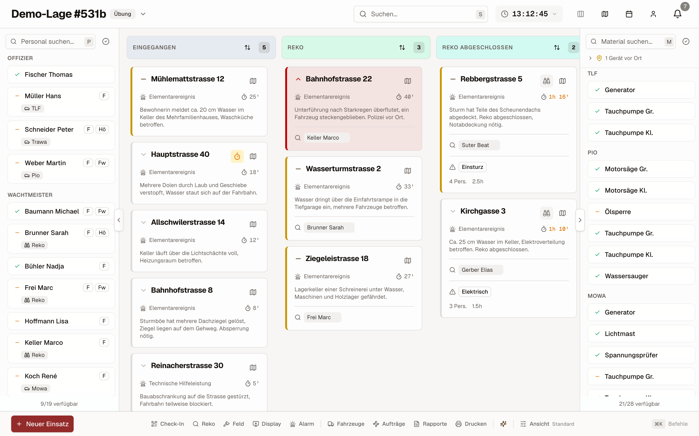
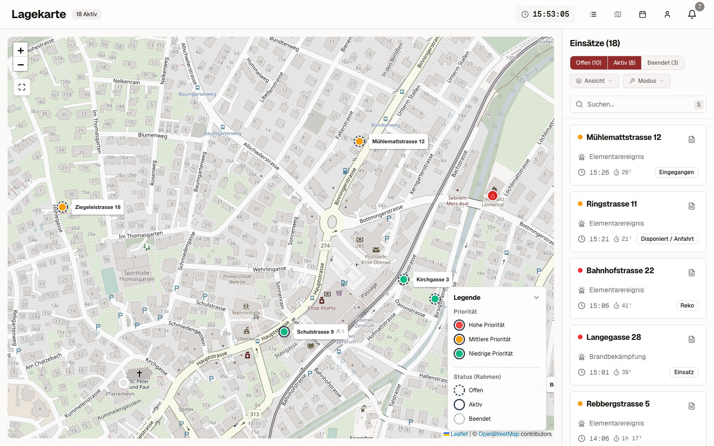
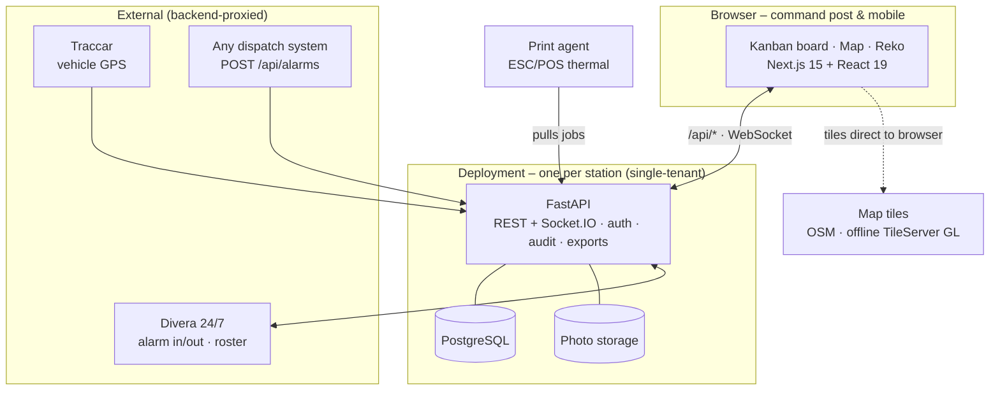

# KP Rück

[](https://www.gnu.org/licenses/agpl-3.0)
[](https://github.com/feuerwehr-oberwil/kp-rueck/actions/workflows/ci.yml)
[](https://demo.kp-rueck.ch)

**Tactical operations board for the rear command post (KP Rück).** KP Rück replaces the
physical magnet board used to track personnel, vehicles, materials, and incidents during an
operation – a shared Kanban board, an incident map, resource assignments, and a defensible
record, all live across every connected device.

One operator runs it from the command post on a desktop with mouse and keyboard; viewers
follow along read-only on any screen. KP Rück owns its own incident state, map, audit trail, and exports – integrations
(Divera, Traccar, a thermal printer) add data but are not required to operate it.

Originally developed by [Feuerwehr Oberwil BL](https://www.feuerwehr-oberwil.ch/) and designed
to be adaptable for any fire department.

| Operations Board | Interactive Map |
|:---:|:---:|
|  |  |

## Try the demo

**[Try the live demo](https://demo.kp-rueck.ch)** – no account needed, just pick a
role and go. The demo seeds a realistic board and resets on a schedule; each visitor gets an
isolated training sandbox.

## Why KP Rück

KP Rück grew out of a Swiss Milizfeuerwehr command post. It is built around **one station, one
event, one operator at the board**, not scaled down from a dispatch center.

- **Replaces the magnet board.** The same spatial mental model – columns for status, cards for
  incidents, magnets for crew and vehicles – but live, shared, and self-documenting.
- **Made for the command post.** Dense, calm, dark-mode-first and keyboard-fast on a desktop –
  the board is run with mouse and keyboard, not thumbs. Status and priority read at a glance.
- **Provider-neutral intake.** Any dispatch or alarm system can open incidents through one
  generic webhook; Divera, a phone form, and a QR walk-in slip are adapters on top of it.
- **Training that mirrors reality.** A full training mode with auto-generated incidents and
  simulated GPS drives runs on the same database, filtered by a flag – never mixed with live
  work.
- **Keeps working when the network doesn't.** Offline map tiles, a paper Lageblatt fallback,
  automatic thermal snapshots, and a documented outage SOP.
- **Defensible records.** An append-only audit log and an after-action PDF (Einsatztagebuch,
  Reaktionszeiten) back every operation.
- **Open and self-hostable.** One AGPL-licensed deployment per station, no per-seat licence.

## Highlights

- **Board:** drag-and-drop Kanban with persisted card order and real-time sync (WebSocket, with
  a polling fallback).
- **Map:** MapLibre GL incident markers, optional [Traccar](https://www.traccar.org/) vehicle GPS
  with GPS-driven status automation, distance labels, and offline tiles.
- **Resources:** personnel, vehicles, and materials with assignment conflict warnings.
- **Aufträge:** group several incidents into one ordered route for a squad – the storm case,
  where a crew works a list rather than a single address. The board keeps the sequence, the
  crew, and the radio announcement for the whole route. Recurring ones («Sturmholz»,
  «Absperren») are configurable as **Standard-Aufträge** and can open with every new Ereignis,
  carrying their colour, note and usual equipment.
- **Alarm intake:** provider-neutral `POST /api/alarms`, a native Divera adapter, a token-gated
  phone/walk-in form, and a capability registry the UI reads instead of hard-coding providers.
- **The field surface (`/feld`):** one login-less page for everyone out there – crew, driver,
  Reko, Magazin, Telefondienst. You see what is yours, report «Angekommen» and «Einsatz
  beendet», file the Schadenplatz-Rapport with photos, ask for an Abholung, and send a Meldung
  the KP can answer. Reached by a QR on the poster or on the Einsatzzettel, gated by a
  four-digit **Feld-Code** that binds the phone to one person. Everything it writes has a
  writer at the command post too, because the failure mode to design for is the phones failing,
  not the server.
- **Reconnaissance:** Reko forms with photo upload from mobile devices.
- **Training:** isolated scenarios, auto-generated incidents, adjustable sim tempo, and
  simulated GPS drives.
- **Printing:** a standalone thermal print agent (ESC/POS over the network) for dispatch slips
  and QR walk-in slips.
- **Resilience:** paper Lageblatt PDF, automatic thermal board snapshots, and an outage SOP.
- **Reporting:** after-action PDF report and Excel import/export.
- **Access:** Editor (full CRUD) and Viewer (read-only) roles, a German and French (next-intl)
  UI, dark mode, a ⌘K command palette with keyboard shortcuts, and a built-in help page.

See [`CHANGELOG.md`](CHANGELOG.md) for the feature history.

## Status

KP Rück is in operational use at Feuerwehr Oberwil and under active development. Each
single-tenant deployment supplies its own branding, fleet, personnel roster, and integration
credentials. The UI ships in German (Swiss firefighting terminology) and French (CSSP
terminology); the next-intl layer merges every locale over German, so a further language is a
tractable contribution – it becomes selectable once it covers every German key.

## Quick Start

```bash
git clone https://github.com/feuerwehr-oberwil/kp-rueck.git
cd kp-rueck
just dev    # or: docker compose -f docker-compose.dev.yml up --build
```

This starts the frontend (`:3000`), backend (`:8000`), database, and tile server. The database
is auto-seeded on first run; admin credentials are printed to the terminal.

> **Prerequisites:** Docker and Docker Compose. Optionally
> [just](https://github.com/casey/just) for the shorthand commands. For local development
> without Docker, see [backend/README.md](backend/README.md).

## Self-host

Runs on any Docker host, from **published images** – no build toolchain on the server. **2 GB
RAM and a 32 GB SSD are enough**; all four images are built for `amd64` *and* `arm64`, so a
mini PC, a retired laptop, an ARM VPS or a Raspberry Pi 5 all qualify. Sizing details,
including the one step that does want a bigger machine, are in
[docs/DEPLOYMENT.md §0](docs/DEPLOYMENT.md).

**The fastest path, no terminal (Mac/Windows on a LAN):** download the source zip of the
[latest release](https://github.com/feuerwehr-oberwil/kp-rueck/releases), install
[Docker Desktop](https://www.docker.com/products/docker-desktop/), and double-click
`deploy/Start KP Rück.command` (macOS) or `deploy/Start-KP-Rueck.bat` (Windows). It generates
the secrets, starts the stack and opens the browser – the first visit sets the admin password
and station name at `/setup`. Double-clicking again starts that installed release. Details, including
the one-time Gatekeeper/SmartScreen click, are in
[docs/SETUP.md](docs/SETUP.md#der-schnellste-weg-double-click). Prefer a terminal, a domain
with HTTPS, or your own port? That is the path below.

```bash
git clone https://github.com/feuerwehr-oberwil/kp-rueck.git && cd kp-rueck
git checkout vX.Y.Z   # choose a published release from the releases page; replace X.Y.Z
just init     # three decisions, generates the secrets, writes a complete .env
just up       # pulls ghcr.io/feuerwehr-oberwil/kp-rueck-*, migrates on boot, prints the URL
```

Keep the whole clone and run these from inside it: the stack never builds from this source, but
`docker-compose.yml` mounts `deploy/Caddyfile` and `scripts/` out of it.

Without `just`: `cp .env.example .env`, fill in the *Required* section at the top of that file
– five secrets plus three networking lines, walked through in
[docs/SETUP.md §1](docs/SETUP.md) – then `docker compose up -d`.

**The first boot takes two to three minutes.** Migrations and seeding run before the backend
answers at all, so the board is not up the moment the command returns – `just up` waits for it
and tells you when it is there. Then open
`https://<your DOMAIN>`, or `http://<this-host>:8080` on a LAN, and sign in as `admin` with the
`ADMIN_SEED_PASSWORD` you chose. If it doesn't come up, `just doctor` prints one screen of
containers, health, tiles, last backup and running version. `just down` stops the stack without
deleting anything.

Everything is served through one origin (Caddy in front of frontend, backend and tileserver),
with automatic HTTPS when you set `DOMAIN`. Fresh installs pin the exact downloaded release.
Updates are explicit: back up, install the complete matching release files in the existing
installation folder, and change `KP_RUECK_TAG` deliberately. Follow
[the update procedure](docs/DEPLOYMENT.md#4-updating) and the
[releases](https://github.com/feuerwehr-oberwil/kp-rueck/releases) –
[CHANGELOG.md](CHANGELOG.md) explains what a MAJOR/MINOR/PATCH bump means for a deployment.
All four images (backend, frontend, tileserver, print-agent) are released **together** under one
version: a station runs the set, not a mix.

**Every published image has already run a real fire station.** Feuerwehr Oberwil's production
deployment and the public demo both track `main` continuously; a version tag is a label on a
commit that has been carrying live operations. Releases exist for *other* stations, not for us.

Setting up a station for the first time? Follow **[docs/SETUP.md](docs/SETUP.md)**, which walks
the whole path in order. **[docs/DEPLOYMENT.md](docs/DEPLOYMENT.md)** is the full self-hosting
reference behind it. Prefer not to look after a machine at all?
**[docs/RAILWAY.md](docs/RAILWAY.md)** covers the managed route – same images, same releases,
equally supported. The trade is the one you would expect: a box in the Gerätehaus keeps the
board alive through an internet outage, a managed platform keeps it alive without you.

## Architecture & key decisions

A Next.js frontend talks to a single FastAPI service that owns the database, the photo store,
and every outbound integration – one deployment per station. Full diagrams and rationale live in
[`docs/ARCHITECTURE.md`](docs/ARCHITECTURE.md).


```mermaid
flowchart TB
  subgraph CLIENT["Browser – command post & mobile"]
    UI["Kanban board · Map · Reko<br/>Next.js 15 + React 19"]
  end
  subgraph DEP["Deployment – one per station (single-tenant)"]
    API["FastAPI<br/>REST + Socket.IO · auth · audit · exports"]
    DB[("PostgreSQL")]
    FILES[("Photo storage")]
    API --- DB
    API --- FILES
  end
  subgraph EXT["External (backend-proxied)"]
    DIV["Divera 24/7<br/>alarm in/out · roster"]
    TRC["Traccar<br/>vehicle GPS"]
    HOOK["Any dispatch system<br/>POST /api/alarms"]
  end
  AGENT["Print agent<br/>ESC/POS thermal"]
  TILES["Map tiles<br/>OSM · offline TileServer GL"]
  UI <-->|"/api/* · WebSocket"| API
  API <--> DIV
  TRC --> API
  HOOK --> API
  AGENT -->|"pulls jobs"| API
  UI -. "tiles direct to browser" .-> TILES
```

**Deliberate tradeoffs:**

- **Single-tenant:** one station per deployment keeps ownership and isolation simple.
- **Accounts, not PINs:** the command post has a desk, a network, and named operators, so login
  is username + password (JWT access/refresh, per-username lockout on failures) with optional
  Microsoft Entra ID sign-in. Its sibling KP Front deliberately does the opposite – see
  [Related project](#related-project).
- **Training vs. live:** the same database, separated by a `training_flag`, so drills use the
  real UI without polluting live data.
- **Provider-neutral integrations:** alarm intake and outbound alerting (Ausalarmierung) sit
  behind provider seams – adding a service is a module, not a rewrite – and every integration
  reports through `GET /api/integrations`. Personnel sync and vehicle GPS currently have one
  provider each (Divera, Traccar); they follow the same pattern and can be generalised if a
  station needs a different one.
- **Append-only audit:** operational history is corrected with new events, not rewritten, and
  **nothing expires unless you ask it to** – `AUDIT_RETENTION_DAYS` defaults to `0`, meaning keep
  everything. Set a positive number of days if your retention policy says to prune.
- **Alembic is the only schema truth:** migrations run on boot; the app never creates tables
  implicitly.

## Integrations

The operational integrations below are **optional**. Which providers are active is reported at
`GET /api/integrations`, so the UI adapts instead of hard-coding vendors. Configure secrets through
the documented environment variables or integration setup; database backups can contain
integration credentials and need the same protection.

Address lookup is configured separately: the backend uses **swisstopo** for Swiss locations by
default, with `disabled` and a self-hosted or permitted `nominatim` service as alternatives.
Online map tiles still load from the browser. See [address lookup configuration](docs/DEPLOYMENT.md#address-lookup)
and [privacy](PRIVACY.md#online-services-and-integrations) before choosing external providers.

| Connector | Direction | Works with today | Adding another |
|-----------|-----------|------------------|----------------|
| **Alarm intake** | in | **Any** dispatch system via the open `POST /api/alarms` webhook; a native [Divera 24/7](https://www.divera247.com/) adapter; a token-gated phone/walk-in form | Already open – POST the documented JSON, no code needed. See [docs/ALARM-INTEGRATIONS.md](docs/ALARM-INTEGRATIONS.md) |
| **Outbound alerting** (Ausalarmierung) | out | Divera 24/7 | Implement one `AlarmProvider` adapter in `backend/app/services/alerting/` |
| **Personnel roster sync** | in | Divera 24/7 | A Divera-specific convenience; synced identities are stored provider-neutrally (`personnel_external_identities`), so a second source can be added |
| **Vehicle GPS** | in | [Traccar](https://www.traccar.org/) | Currently Traccar-specific – no abstraction yet. It can be generalised the same way as the alarm connectors if a station uses a different tracker |
| **Sign-in** | in | Local accounts; optional Microsoft Entra ID (OAuth) | Entra-specific today. A generic OIDC adapter would cover Google Workspace, Keycloak, Authentik and Zitadel from the same code path |
| **Printing** | out | Any network/CUPS printer via a pull-based agent (reference agent: ESC/POS thermal) | Point a custom agent at the four print endpoints. See [docs/PRINT_AGENT.md](docs/PRINT_AGENT.md) |

New connectors are welcome contributions – the alarm and alerting seams are the model to copy.

## Known limitations

- **The UI is German and French; everything the backend writes is German.** Both catalogues are
  complete and both languages are selectable per device. But PDFs, Excel exports, thermal print
  output and API error details are German-only, and no French-speaking firefighter has reviewed
  the translation yet. Italian is a registered stub (`it.json` is empty) and stays hidden until
  it covers every German key.
- **The board needs a network.** Offline coverage means map tiles, the paper Lageblatt, and
  automatic thermal snapshots – not offline editing. When the connection goes, you go to paper;
  see [docs/AUSFALL_SOP.md](docs/AUSFALL_SOP.md).
- **Vehicle GPS is Traccar-specific.** Alarm intake and outbound alerting sit behind provider
  seams; GPS does not yet.
- **Sign-in with an external identity provider is Microsoft-only.** There is no generic OIDC
  path, so a station on Google Workspace or Keycloak uses local accounts.
- **One station per deployment.** Running two stations means running two deployments; there is
  no tenant switch, by design.

See [GitHub issues](https://github.com/feuerwehr-oberwil/kp-rueck/issues) for current work.

## Repository layout

```text
kp-rueck/
├── frontend/                 # Next.js 15 (App Router)
│   ├── app/                  # Pages: dashboard, map, settings, help
│   ├── components/           # React components + shadcn/ui
│   ├── messages/             # next-intl catalogues (de.json canonical, fr.json complete)
│   └── lib/                  # API client, contexts, utilities
├── backend/                  # FastAPI
│   ├── app/api/              # Route handlers
│   ├── app/services/         # Business logic (Divera, Traccar, alerting, GPS, PDF)
│   ├── app/models.py         # SQLAlchemy models
│   └── alembic/              # Database migrations
├── tools/print-agent/        # Standalone print agent (serves KP Rück *and* KP Front)
├── tileserver/               # Offline map tile server
├── docker-compose.dev.yml    # Development setup
└── justfile                  # Task runner (run `just` for all commands)
```

## Documentation

Start with the [documentation index](docs/README.md). Highlights:

| Document | Description |
|----------|-------------|
| [docs/SETUP.md](docs/SETUP.md) | **Start here** for a new station: the ordered path from an empty host to a board you can run an event on |
| [docs/DEPLOYMENT.md](docs/DEPLOYMENT.md) | The self-hosting reference behind it: the compose stack, version pinning, updates and rollback, backups |
| [docs/ARCHITECTURE.md](docs/ARCHITECTURE.md) | System architecture and deployment diagrams |
| [docs/ALARM-INTEGRATIONS.md](docs/ALARM-INTEGRATIONS.md) | Provider-neutral alarm webhook and integration registry |
| [docs/RAILWAY.md](docs/RAILWAY.md) | Railway deployment guide – the managed path, equally supported |
| [docs/PRINT_AGENT.md](docs/PRINT_AGENT.md) | Thermal printer and print agent |
| [docs/OFFLINE_MAPS.md](docs/OFFLINE_MAPS.md) | Offline map tiles setup – any region, Basel-Landschaft is only the default |
| [docs/AUSFALL_SOP.md](docs/AUSFALL_SOP.md) | Outage / paper-fallback standard operating procedure |
| [docs/openapi.json](docs/openapi.json) | The committed API contract – every route, request and response, readable without booting the stack. Several setup steps are faster through the API than the UI |
| [backend/README.md](backend/README.md) | Backend service internals – for working *on* it, not for running a station |
| [PRIVACY.md](PRIVACY.md) | What this app does and does not send anywhere – nothing, until a station switches it on |
| [CONTRIBUTING.md](CONTRIBUTING.md) | Contribution guidelines |

## Related project

KP Rück runs the **rear** command post – the resource board. If you're looking for **frontline**
Einsatzführung – a shared Lagekarte, tactical symbols, Atemschutz (SCBA) tracking, and object
plans – see its companion **[KP Front](https://github.com/feuerwehr-oberwil/kp-front)**
([live demo](https://demo.kp-front.ch)).

The two grew out of the same brigade and share a design language, but they are **completely
independent** codebases and deployments – neither requires the other. Both expose a generic `POST /api/alarms` webhook, but they are not plug-compatible: the
payloads and auth differ, so KP Front can feed KP Rück through a short adapter you write,
and KP Rück has no outbound webhook to push the other way. Nothing else connects them –
separate databases, separate auth, separate deployments. See
[`docs/ALARM-INTEGRATIONS.md`](docs/ALARM-INTEGRATIONS.md).

Their sign-in models differ on purpose. KP Rück runs at a desk with a network, so it uses named
accounts and can defer to an identity provider. KP Front runs on a tablet at the Einsatzort,
where an identity-provider round-trip would be a network dependency on the one path that has to
work at 3am in a cellar with no signal – so it keeps a local PIN.

## Contributing

Contributions are welcome: bug fixes, integrations, translations, or ideas. See
**[CONTRIBUTING.md](CONTRIBUTING.md)** for guidelines.

Need help, or want to know what you can expect from a one-maintainer project before you rely on
it? **[SUPPORT.md](SUPPORT.md)** says so plainly.

## License

[AGPL-3.0-or-later](LICENSE) – free to use, modify, and deploy. Modified versions served over a
network must share their source under the same license.

Copyright © 2026 Bastian Eichenberger.

## Acknowledgments

- **[Feuerwehr Oberwil BL](https://www.feuerwehr-oberwil.ch/)** – original development and
  real-world testing
- [shadcn/ui](https://ui.shadcn.com/), [OpenStreetMap](https://www.openstreetmap.org/),
  [TileServer GL](https://github.com/maptiler/tileserver-gl),
  [Planetiler](https://github.com/onthegomap/planetiler)
