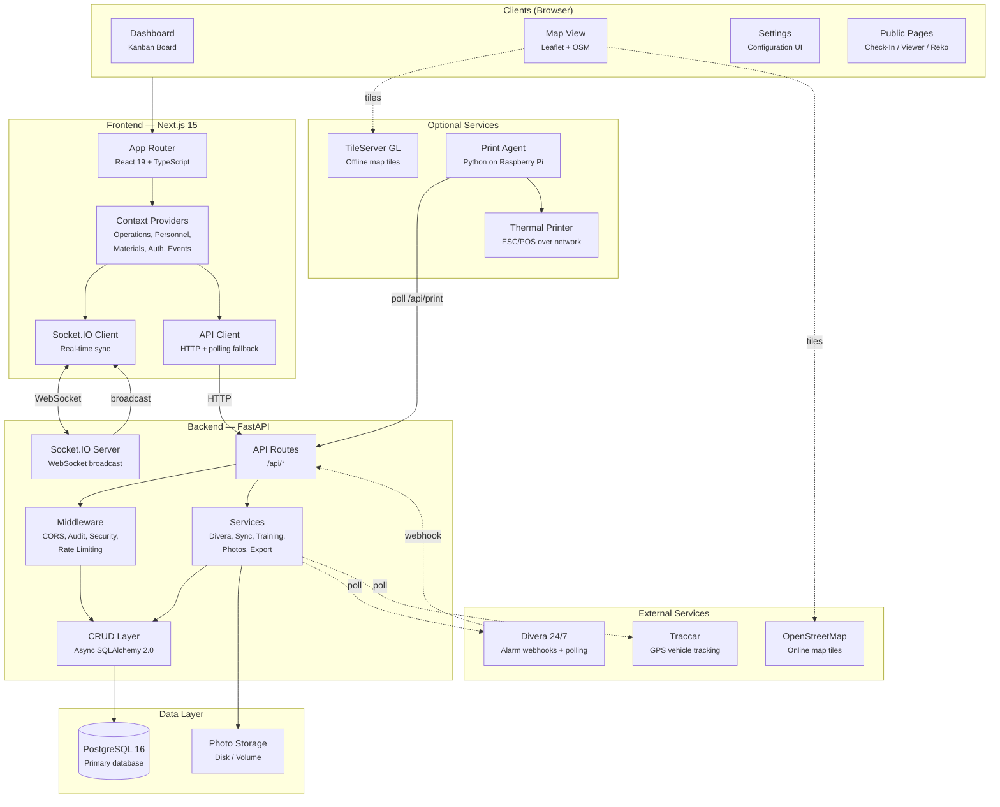
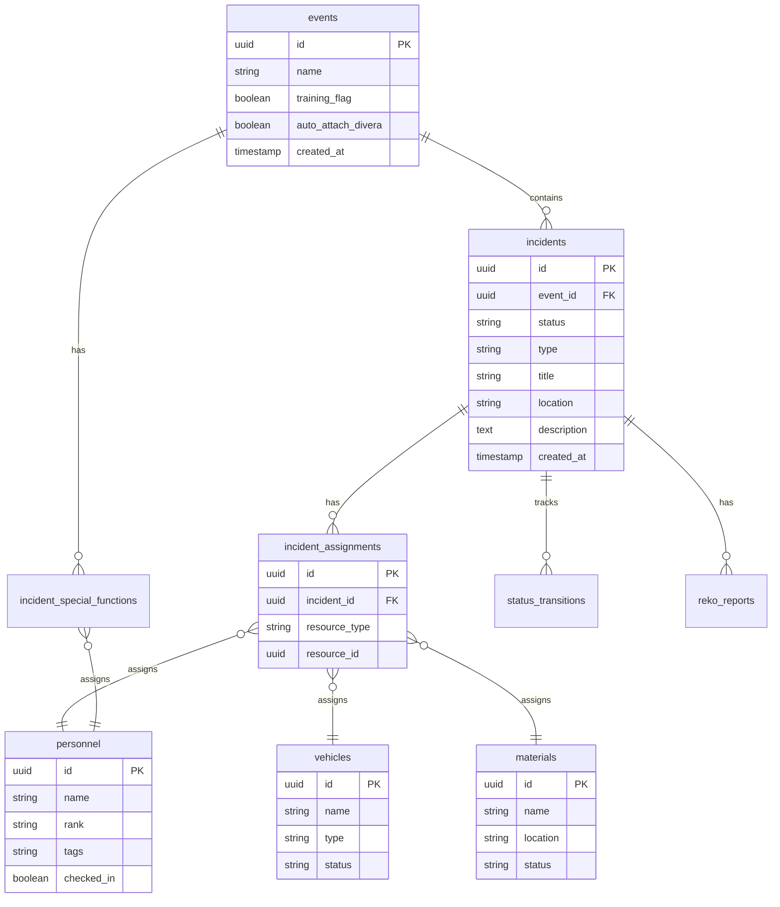
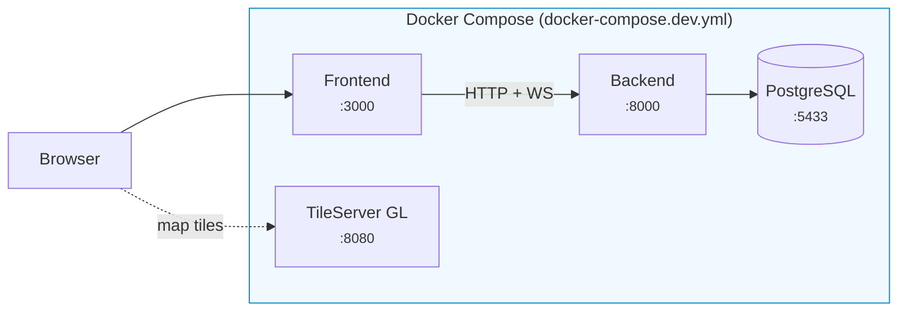
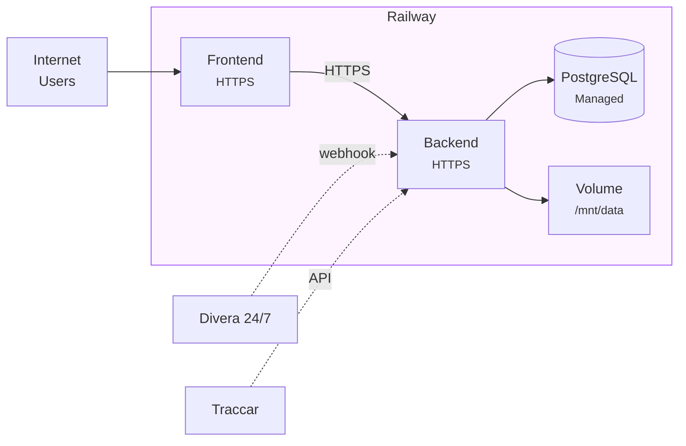
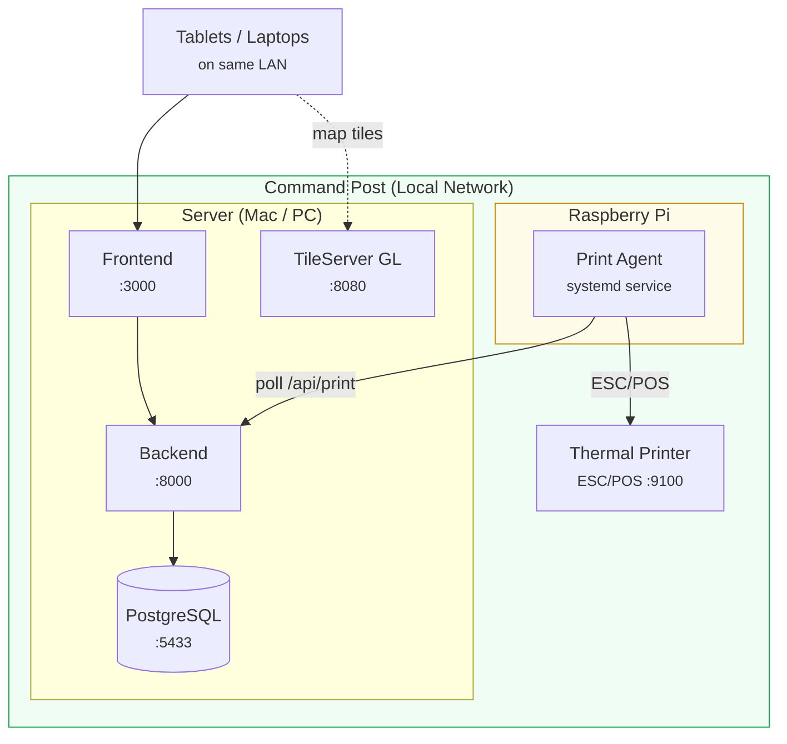
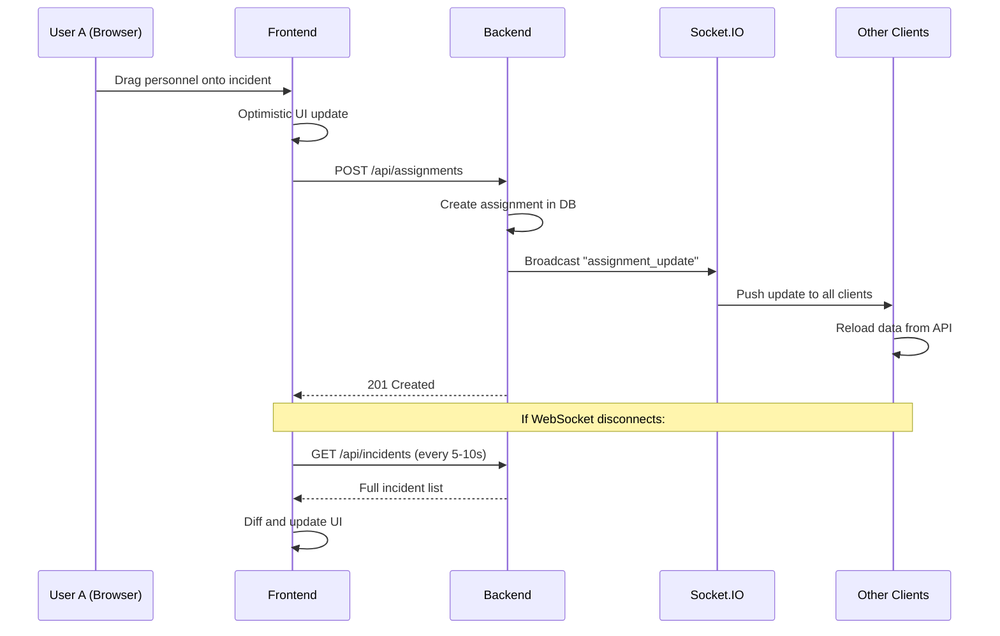
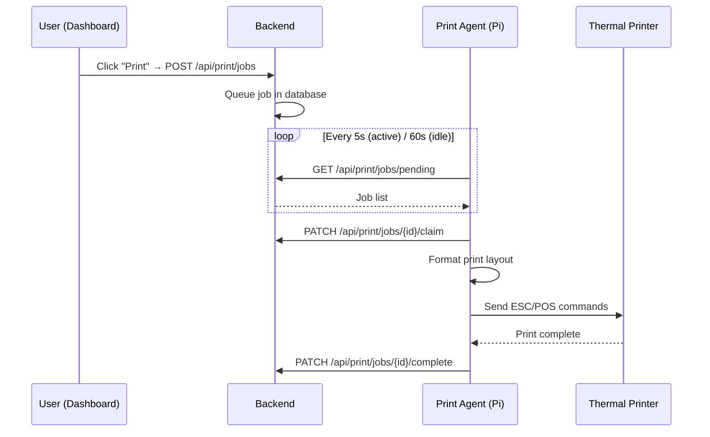
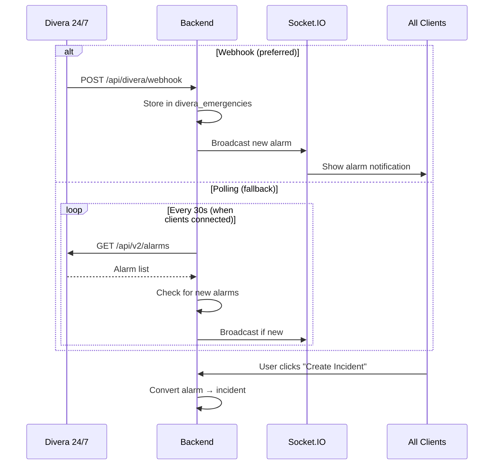
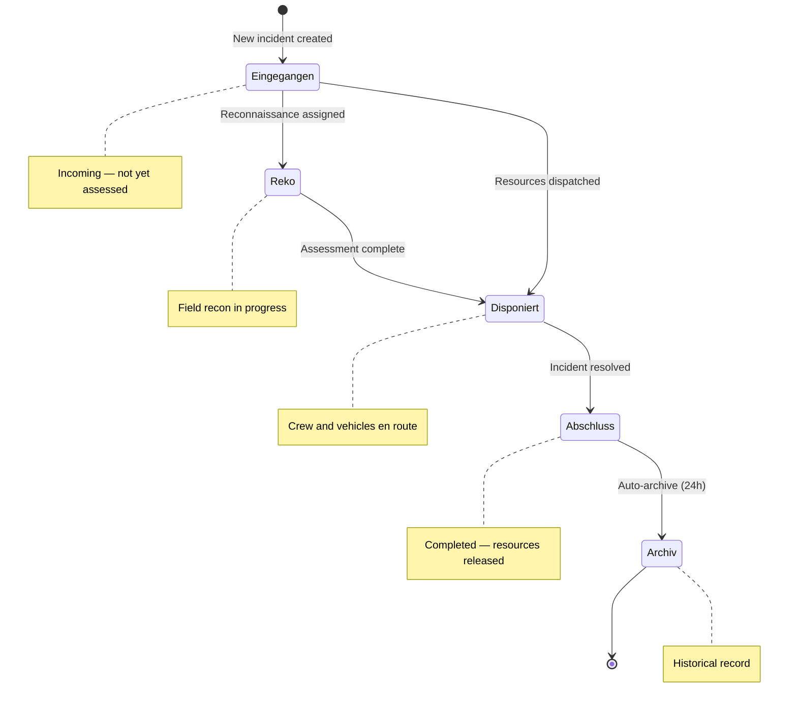
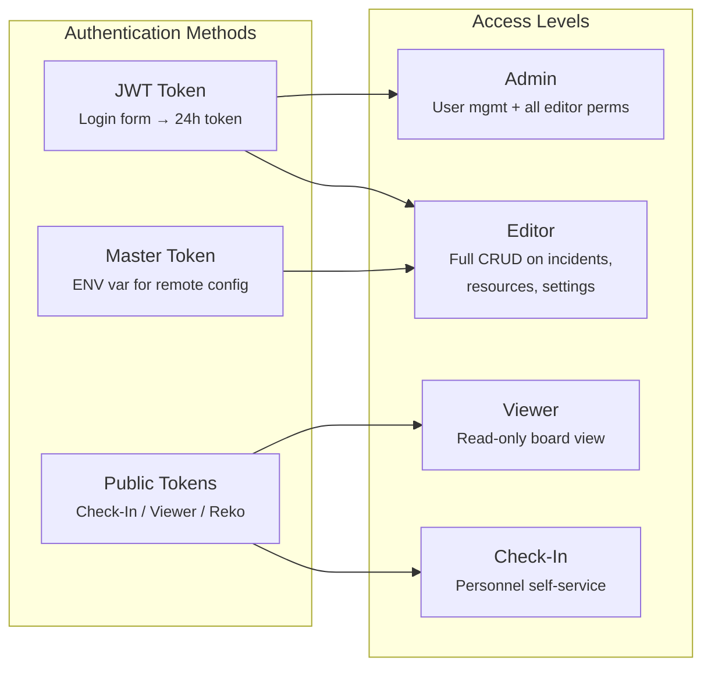

# Architecture Overview

This document describes the components that make up KP Ruck, how they communicate, and the different ways the system can be deployed.

---

## System Overview

---

## Component Details

### Frontend (Next.js 15)

| Component | Responsibility |
|-----------|---------------|
| **App Router** | Page routing, server/client component split, layouts |
| **Operations Context** | Core state: incidents, assignments, drag-and-drop, optimistic updates |
| **Personnel Context** | Personnel list, check-in status, availability tracking |
| **Materials Context** | Material inventory, location-based grouping |
| **Auth Context** | JWT tokens, role checks (editor/viewer/admin) |
| **Event Context** | Event selection (training vs live), event metadata |
| **Socket.IO Client** | WebSocket connection with auto-reconnect, polling fallback |
| **API Client** | Centralized HTTP client, error handling, conflict detection (409) |

### Backend (FastAPI)

| Component | Responsibility |
|-----------|---------------|
| **API Routes** | 28 route modules covering incidents, resources, print, integrations, admin |
| **Middleware Stack** | CORS, audit logging, security headers, rate limiting |
| **CRUD Layer** | Async database operations with eager loading (prevents N+1 queries) |
| **WebSocket Manager** | Socket.IO server, room-based broadcasting per event |
| **Services** | Business logic: Divera polling, sync, training auto-generation, photo storage, exports |
| **Auth / Tokens** | JWT generation, validation, blocklist, role-based access |

### Database (PostgreSQL 16)

**Additional tables** (not shown): `users`, `settings`, `audit_log`, `divera_emergencies`, `token_blocklist`, `incident_special_functions`, `reko_reports`, `status_transitions`

### Print Agent (Standalone Python)

| Component | Responsibility |
|-----------|---------------|
| **agent.py** | Polling loop with adaptive intervals (idle: 60s, active: 5s) |
| **printer.py** | ESC/POS network printer driver (58mm thermal paper) |
| **formatters.py** | Print layout: assignment slips, board snapshots |

---

## Deployment Architectures

KP Ruck supports three deployment modes depending on the use case.

### Local Development (Docker Compose)

For development with hot reload. All services run in containers on a single machine.

| Service | Container | Port | Notes |
|---------|-----------|------|-------|
| PostgreSQL | `kprueck-db-dev` | 5433 | Persistent volume, auto-healthcheck |
| Backend | `kprueck-backend-dev` | 8000 | Hot reload via `start-dev.sh`, auth bypass available |
| Frontend | `kprueck-frontend-dev` | 3000 | `pnpm dev` with volume mounts |
| TileServer | `kprueck-tileserver-dev` | 8080 | Auto-creates bootstrap tiles on first run |
| Print Agent | *(optional, profile=printing)* | host network | Requires physical printer on LAN |

### Cloud Production (Railway)

For internet-facing deployments. Three services on Railway, no tile server.

| Service | Configuration | Notes |
|---------|--------------|-------|
| PostgreSQL | Railway managed | Auto-backups, `DATABASE_URL` injected |
| Backend | `start.sh` + Dockerfile | `SECRET_KEY` required, Swagger docs disabled |
| Frontend | `node server.js` | Production build, `NEXT_PUBLIC_API_URL` set |
| Volume | `/mnt/data` | Persistent photo storage (Reko reports) |

Maps use **online-only** OpenStreetMap tiles (no tile server on Railway).

### Command Post (Offline-capable)

For field deployments at a physical command post. Runs on a local machine with an optional Raspberry Pi for thermal printing.

| Component | Location | Notes |
|-----------|----------|-------|
| Backend + DB + Frontend | Local machine | `just dev` or native install |
| TileServer GL | Local machine | Pre-downloaded offline tiles for the region |
| Print Agent | Raspberry Pi | Connected via LAN, polls backend for print jobs |
| Thermal Printer | Network printer | ESC/POS protocol, 58mm paper (e.g. Epson TM-T20) |
| Clients | Any device on LAN | Tablets, laptops, phones -- browser only |

Works **fully offline** once tiles are downloaded and no external integrations are needed.

---

## Communication Patterns

### Real-time Sync

All clients stay in sync via WebSocket with a polling fallback:

### Print Flow

### Divera Alarm Import

---

## Incident Lifecycle

An incident progresses through these stages:

At each transition:
- A `status_transition` record is created (audit trail)
- WebSocket broadcasts the change to all connected clients
- Moving to **Abschluss** automatically releases all assigned personnel, vehicles, and materials

---

## Authentication & Roles

| Token Type | How Obtained | Expiry | Access |
|------------|-------------|--------|--------|
| JWT (access) | Login form | 24 hours | Full editor or admin |
| Master Token | Environment variable | Never | Editor-level API access |
| Viewer Token | Generated in UI (QR code) | Long-lived | Read-only board |
| Check-In Token | Generated in UI (QR code) | Long-lived | Personnel check-in form only |
| Reko Token | Generated in UI (QR code) | Long-lived | View assigned Reko forms |

---

## Technology Decisions

| Decision | Choice | Rationale |
|----------|--------|-----------|
| **Real-time sync** | Socket.IO + polling fallback | WebSocket for speed, polling for reliability in unstable field networks |
| **Database** | PostgreSQL | Robust, widely supported, async driver available (asyncpg) |
| **ORM** | SQLAlchemy 2.0 async | Type-safe, eager loading, migration support via Alembic |
| **Frontend framework** | Next.js 15 App Router | Server components by default, great DX, React 19 features |
| **State management** | React Context | Sufficient for this scale, no external state library needed |
| **UI components** | shadcn/ui + Tailwind CSS 4 | Composable, accessible, easy to customize |
| **Map tiles** | Leaflet + self-hosted TileServer GL | Offline-capable, free OSM data, no vendor lock-in |
| **Thermal printing** | Separate agent (Python) | Decoupled from web server, runs on dedicated hardware (Pi) |
| **Package managers** | pnpm + uv | Fast, disk-efficient, modern |
| **Auth** | JWT (stateless) + token blocklist | Simple, works across deployments, no session store needed |
