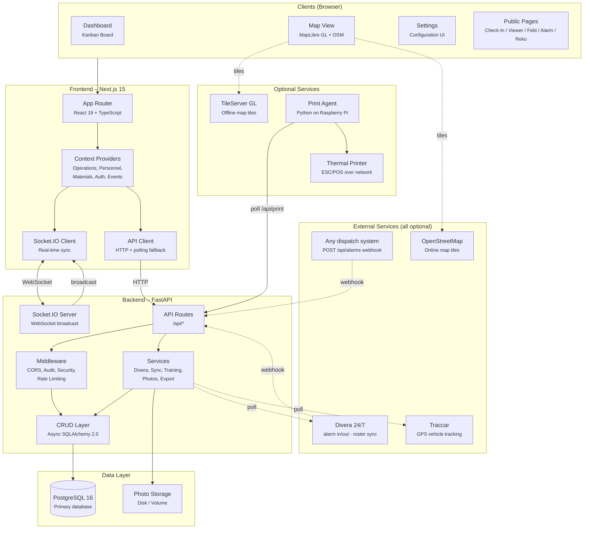
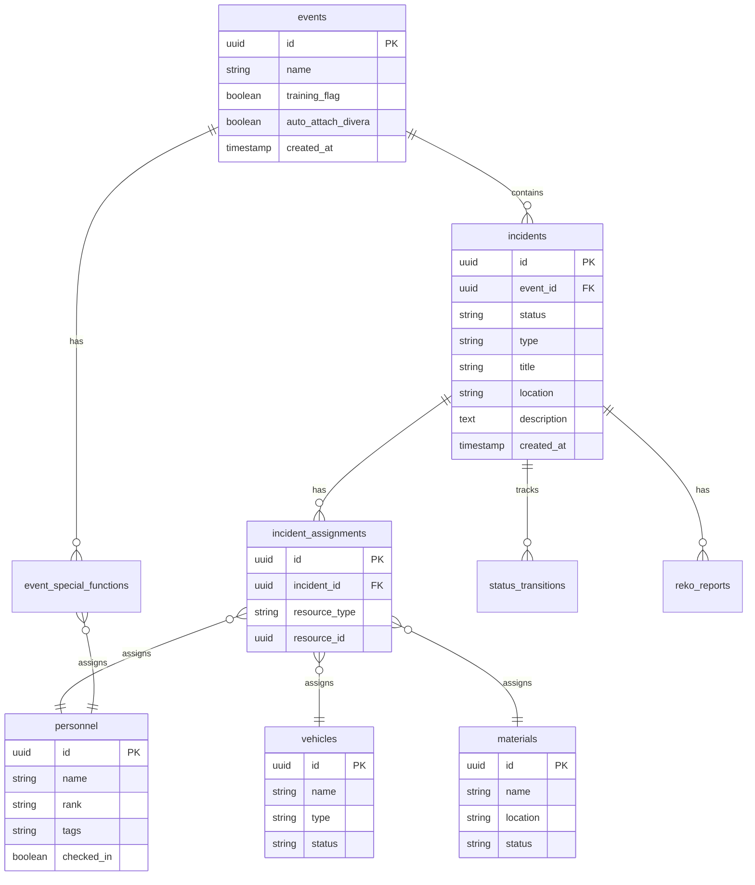
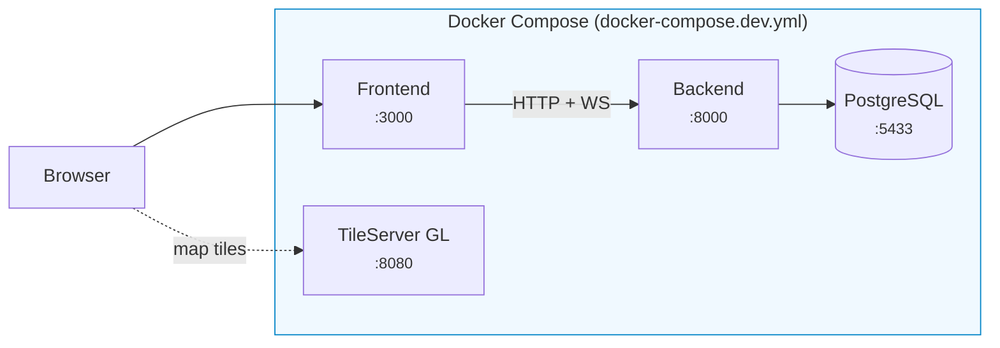
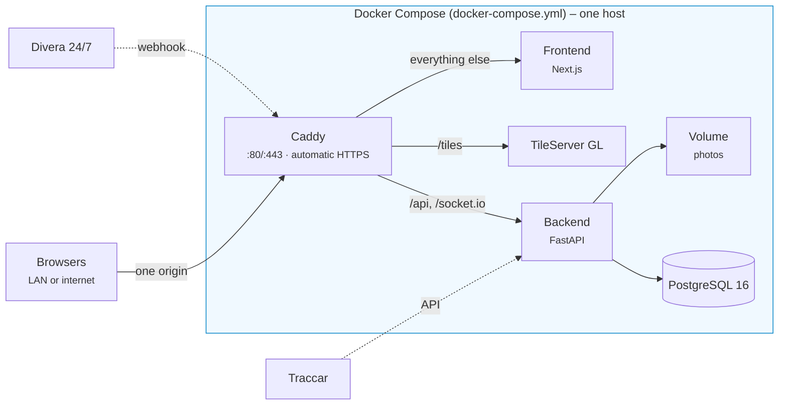
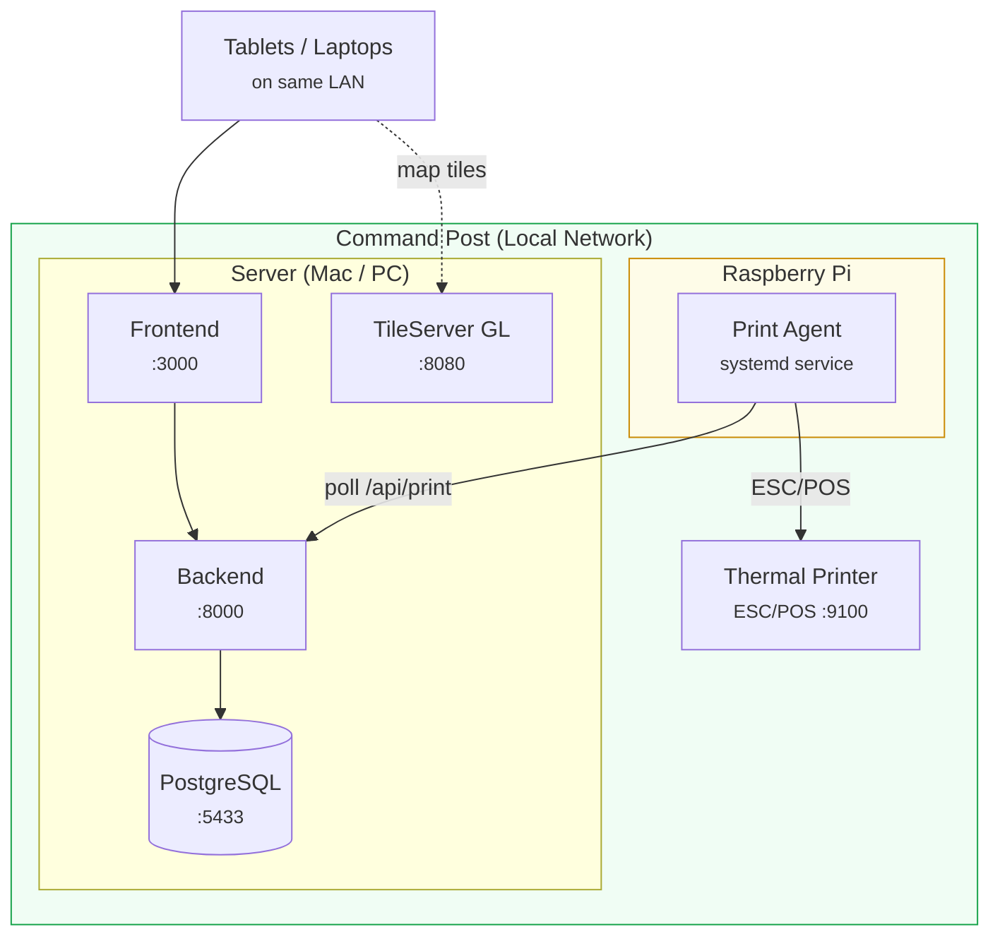
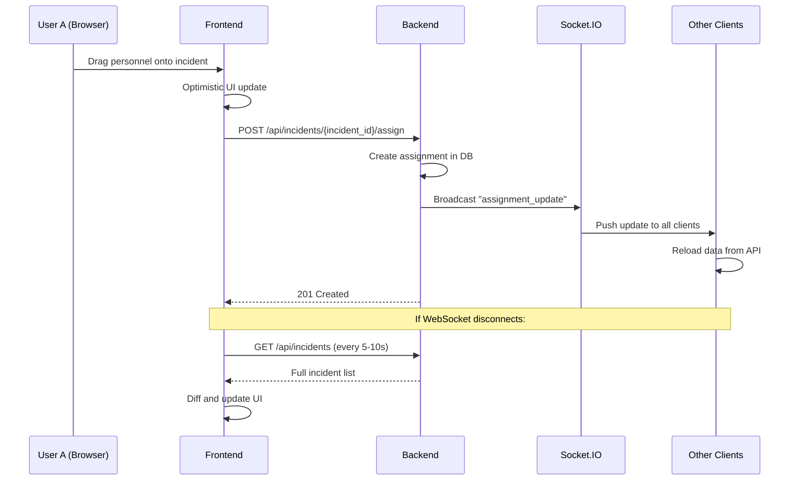
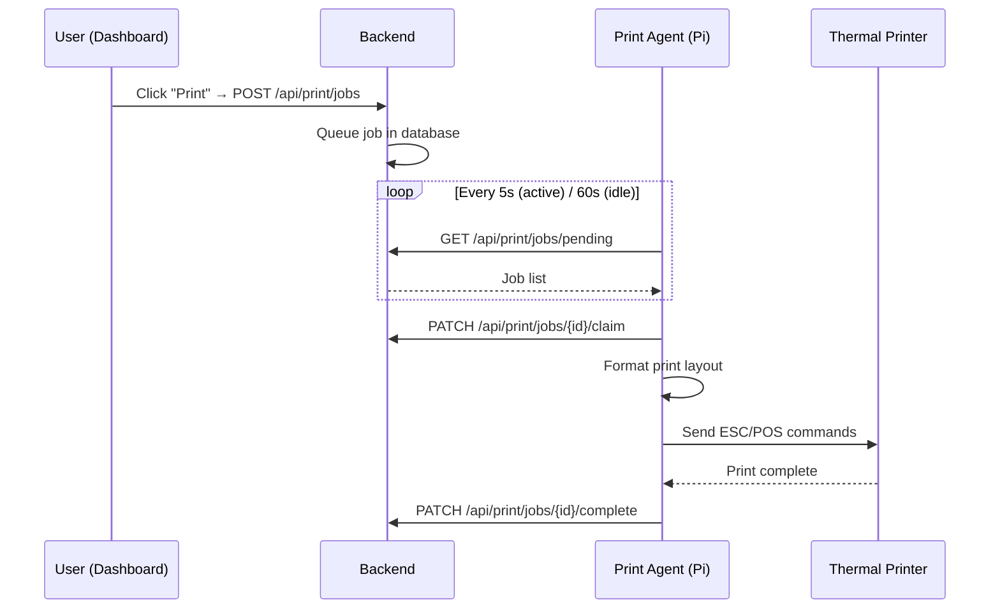
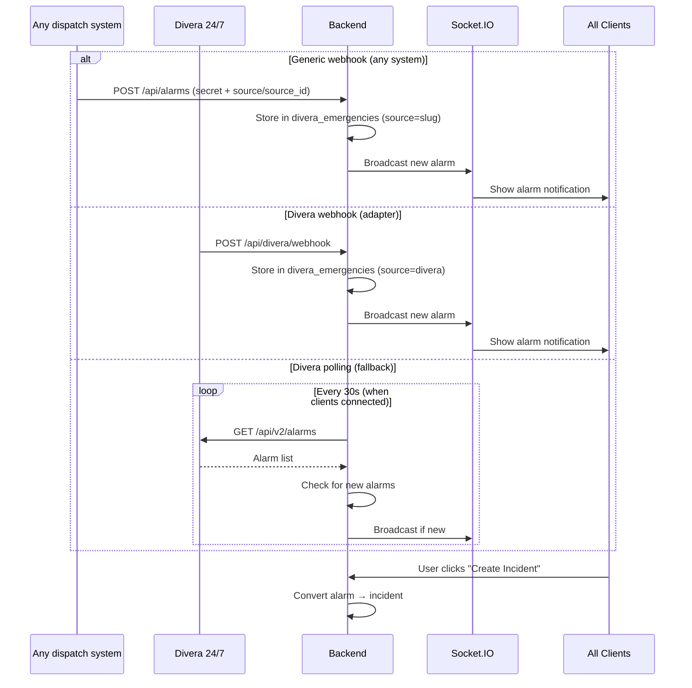
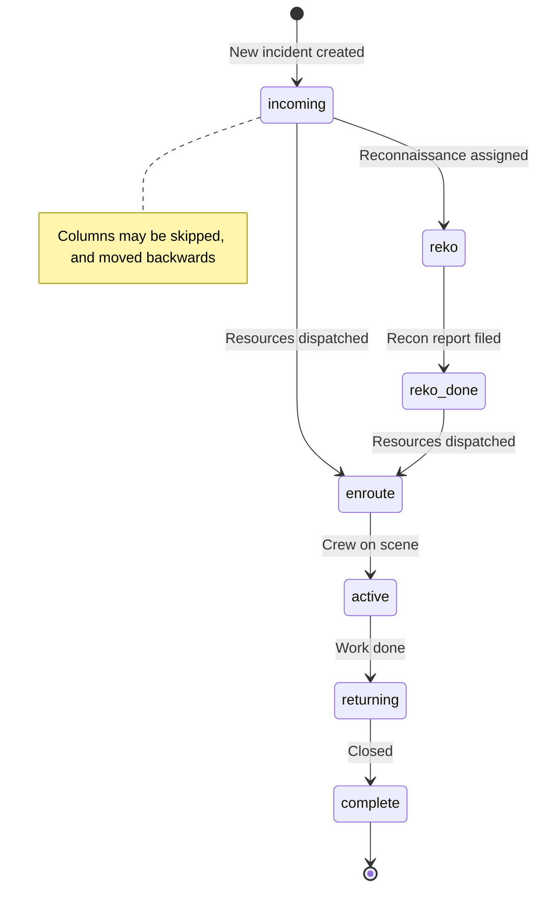
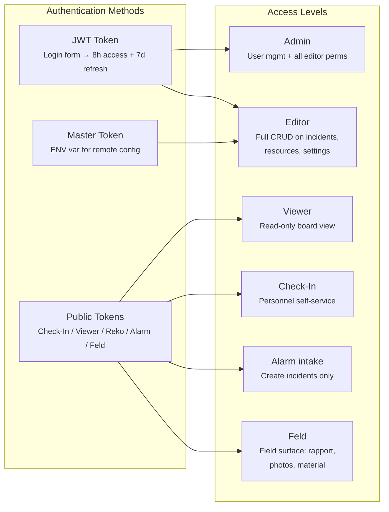

# Architecture Overview

This document describes the components that make up KP Rück, how they communicate, and the different ways the system can be deployed.

---

## System Overview

```mermaid
graph TB
    subgraph clients["Clients (Browser)"]
        dashboard["Dashboard<br/><small>Kanban Board</small>"]
        mapview["Map View<br/><small>MapLibre GL + OSM</small>"]
        settings["Settings<br/><small>Configuration UI</small>"]
        public["Public Pages<br/><small>Check-In / Viewer / Feld / Alarm / Reko</small>"]
    end

    subgraph frontend["Frontend – Next.js 15"]
        app["App Router<br/><small>React 19 + TypeScript</small>"]
        contexts["Context Providers<br/><small>Operations, Personnel,<br/>Materials, Auth, Events</small>"]
        ws_client["Socket.IO Client<br/><small>Real-time sync</small>"]
        api_client["API Client<br/><small>HTTP + polling fallback</small>"]
    end

    subgraph backend["Backend – FastAPI"]
        routes["API Routes<br/><small>/api/*</small>"]
        ws_server["Socket.IO Server<br/><small>WebSocket broadcast</small>"]
        services["Services<br/><small>Divera, Sync, Training,<br/>Photos, Export</small>"]
        crud["CRUD Layer<br/><small>Async SQLAlchemy 2.0</small>"]
        middleware["Middleware<br/><small>CORS, Audit, Security,<br/>Rate Limiting</small>"]
    end

    subgraph data["Data Layer"]
        postgres[("PostgreSQL 16<br/><small>Primary database</small>")]
        photos["Photo Storage<br/><small>Disk / Volume</small>"]
    end

    subgraph optional["Optional Services"]
        tileserver["TileServer GL<br/><small>Offline map tiles</small>"]
        print_agent["Print Agent<br/><small>Python on Raspberry Pi</small>"]
        printer["Thermal Printer<br/><small>ESC/POS over network</small>"]
    end

    subgraph external["External Services (all optional)"]
        anyhook["Any dispatch system<br/><small>POST /api/alarms webhook</small>"]
        divera["Divera 24/7<br/><small>alarm in/out · roster sync</small>"]
        traccar["Traccar<br/><small>GPS vehicle tracking</small>"]
        osm["OpenStreetMap<br/><small>Online map tiles</small>"]
    end

    clients --> app
    app --> contexts
    contexts --> ws_client
    contexts --> api_client
    ws_client <-->|WebSocket| ws_server
    api_client -->|HTTP| routes
    mapview -.->|tiles| tileserver
    mapview -.->|tiles| osm

    routes --> middleware
    middleware --> crud
    routes --> services
    services --> crud
    crud --> postgres
    services --> photos

    ws_server -->|broadcast| ws_client

    anyhook -.->|webhook| routes
    divera -.->|webhook| routes
    services -.->|poll| divera
    services -.->|poll| traccar

    print_agent -->|poll /api/print| routes
    print_agent --> printer
```

---

## Component Details

### Frontend (Next.js 15)

| Component | Responsibility |
|-----------|---------------|
| **App Router** | Page routing and layouts – every page is a client component; the board is a live surface with no server-rendered page |
| **Operations Context** | Core state: incidents, assignments, drag-and-drop, optimistic updates |
| **Personnel Context** | Personnel list, check-in status, availability tracking |
| **Materials Context** | Material inventory, location-based grouping |
| **Auth Context** | JWT tokens, role checks (editor/viewer/admin) |
| **Event Context** | Event selection (training vs live), event metadata |
| **Socket.IO Client** | WebSocket connection with auto-reconnect, polling fallback |
| **API Client** | Centralized HTTP client, error handling, conflict detection (409) |

### Backend (FastAPI)

| Component | Responsibility |
|-----------|---------------|
| **API Routes** | 33 route modules covering incidents, resources, feld, print, integrations, setup, admin |
| **Middleware Stack** | CORS, audit logging, security headers, rate limiting |
| **CRUD Layer** | Async database operations with eager loading (prevents N+1 queries) |
| **WebSocket Manager** | Socket.IO server, room-based broadcasting per event |
| **Services** | Business logic: alarm intake + inference (`divera_intake`), outbound alerting providers (`alerting/`), Divera/Traccar polling, sync, training auto-generation, photo storage, exports |
| **Auth / Tokens** | JWT generation, validation, blocklist, role-based access |

### Database (PostgreSQL 16)

```mermaid
erDiagram
    events ||--o{ incidents : contains
    events ||--o{ event_special_functions : has
    incidents ||--o{ incident_assignments : has
    incidents ||--o{ status_transitions : tracks
    incidents ||--o{ reko_reports : has
    incident_assignments }o--|| personnel : assigns
    incident_assignments }o--|| vehicles : assigns
    incident_assignments }o--|| materials : assigns
    event_special_functions }o--|| personnel : assigns

    events {
        uuid id PK
        string name
        boolean training_flag
        boolean auto_attach_divera
        timestamp created_at
    }
    incidents {
        uuid id PK
        uuid event_id FK
        string status
        string type
        string title
        string location
        text description
        timestamp created_at
    }
    personnel {
        uuid id PK
        string name
        string rank
        string tags
        boolean checked_in
    }
    vehicles {
        uuid id PK
        string name
        string type
        string status
    }
    materials {
        uuid id PK
        string name
        string location
        string status
    }
    incident_assignments {
        uuid id PK
        uuid incident_id FK
        string resource_type
        uuid resource_id
    }
```

**Additional tables** (not shown): `users`, `settings`, `audit_log`, `divera_emergencies`, `revoked_tokens` (the persisted JWT blocklist), `event_special_functions`, `reko_reports`, `status_transitions`, `personnel_external_identities`, `print_jobs`, `telemetry_outbox`, `notifications`

### Print Agent (Standalone Python)

| Component | Responsibility |
|-----------|---------------|
| **agent.py** | Polling loop with adaptive intervals (idle: 60s, active: 5s) |
| **core.py** | Job model, HTTP client, claim/report state machine (stdlib only) |
| **protocols/** | One module per backend wire contract (`front.py`, `rueck.py`) |
| **outputs/** | One module per device (`escpos.py` thermal, `cups.py` A4 laser) |
| **formatters.py** | Print layout: assignment slips, board snapshots |

---

## Deployment Architectures

The **self-hosted production stack** below is the reference deployment – it is what published releases are built and tested for, and what [`DEPLOYMENT.md`](DEPLOYMENT.md) documents. The others are the development stack, the same production stack tuned for a command post with no internet, and a legacy managed-PaaS layout.

### Local Development (Docker Compose)

For development with hot reload. All services run in containers on a single machine.

```mermaid
graph LR
    subgraph docker["Docker Compose (docker-compose.dev.yml)"]
        fe["Frontend<br/><small>:3000</small>"]
        be["Backend<br/><small>:8000</small>"]
        db[("PostgreSQL<br/><small>:5433</small>")]
        tiles["TileServer GL<br/><small>:8080</small>"]
    end

    browser["Browser"] --> fe
    fe -->|HTTP + WS| be
    be --> db
    browser -.->|map tiles| tiles

    style docker fill:#f0f9ff,stroke:#0284c7
```

| Service | Container | Port | Notes |
|---------|-----------|------|-------|
| PostgreSQL | `kprueck-db-dev` | 5433 | Persistent volume, auto-healthcheck |
| Backend | `kprueck-backend-dev` | 8000 | Hot reload via `start-dev.sh`, auth bypass available |
| Frontend | `kprueck-frontend-dev` | 3000 | `pnpm dev` with volume mounts |
| TileServer | `kprueck-tileserver-dev` | 8080 | Auto-creates bootstrap tiles on first run |
| Print Agent | *(optional, profile=printing)* | host network | Requires physical printer on LAN |

### Self-hosted Production (Docker Compose + Caddy)

The reference deployment: one box, one origin, published images from GHCR pinned by
`KP_RUECK_TAG`. Caddy terminates TLS and fans out by path, which is why the frontend image
carries no station URL – the browser only ever talks to its own host.

```mermaid
graph LR
    subgraph host["Docker Compose (docker-compose.yml) – one host"]
        caddy["Caddy<br/><small>:80/:443 · automatic HTTPS</small>"]
        fe_prod["Frontend<br/><small>Next.js</small>"]
        be_prod["Backend<br/><small>FastAPI</small>"]
        db_prod[("PostgreSQL 16")]
        tiles_prod["TileServer GL"]
        vol["Volume<br/><small>photos</small>"]
    end

    users["Browsers<br/><small>LAN or internet</small>"] -->|one origin| caddy
    caddy -->|"/api, /socket.io"| be_prod
    caddy -->|"/tiles"| tiles_prod
    caddy -->|"everything else"| fe_prod
    be_prod --> db_prod
    be_prod --> vol

    divera["Divera 24/7"] -.->|webhook| caddy
    traccar["Traccar"] -.->|API| be_prod

    style host fill:#f0f9ff,stroke:#0284c7
```

| Service | Image | Notes |
|---------|-------|-------|
| Caddy | `caddy:2-alpine` | Single origin. Automatic HTTPS when `DOMAIN` is set; plain HTTP on `HTTP_PORT` for a LAN-only install. The backend reads `CORS_ORIGINS`, sees a plain `http://` origin and drops the `Secure` flag from login cookies itself, so a LAN install sets nothing extra – `AUTH_COOKIE_SECURE` is an override, not a step. |
| Backend | `ghcr.io/feuerwehr-oberwil/kp-rueck-backend` | `start.sh` runs `alembic upgrade head` on boot. `ENVIRONMENT=production` makes the secrets mandatory and disables the auth bypass, sample data and Swagger. |
| Frontend | `ghcr.io/feuerwehr-oberwil/kp-rueck-frontend` | Built **without** `NEXT_PUBLIC_API_URL` on purpose – baking a URL in would tie the image to one station. The browser calls `/backend-api` on its own origin and Next forwards to the runtime `API_URL`. |
| PostgreSQL | `postgres:16-alpine` | Named volume. `DATABASE_URL` is composed in `docker-compose.yml` from the `POSTGRES_*` values. |
| TileServer | `ghcr.io/feuerwehr-oberwil/kp-rueck-tileserver` | Offline tiles, reachable at `/tiles`. Optional but recommended – it is what keeps the map alive without internet. |
| Print Agent | `ghcr.io/feuerwehr-oberwil/kp-print-agent` | Optional – add `printing` to `COMPOSE_PROFILES` in `.env`, amd64 + arm64. |

All four published images share one tag; a station runs a matched set, never a mix.

### Cloud (managed PaaS) – legacy

Feuerwehr Oberwil's own deployment grew up on Railway, and [`RAILWAY.md`](RAILWAY.md) still
describes that layout: three services, managed Postgres, a `/mnt/data` volume for Reko photos,
online-only OSM tiles (no tile server). The runtime no longer assumes Railway and this path is
not maintained in step with the compose stack – it is documented for deployments already on it,
not recommended for new ones.

### Command Post (Offline-capable)

The same production stack as above, on a machine at the command post with offline tiles installed and an optional Raspberry Pi for thermal printing. Nothing about the images or compose file differs – only the configuration (no `DOMAIN`, tiles downloaded, print agent enabled).

```mermaid
graph TB
    subgraph cp["Command Post (Local Network)"]
        subgraph mac["Server (Mac / PC)"]
            fe_local["Frontend<br/><small>:3000</small>"]
            be_local["Backend<br/><small>:8000</small>"]
            db_local[("PostgreSQL<br/><small>:5433</small>")]
            tiles_local["TileServer GL<br/><small>:8080</small>"]
        end
        subgraph pi["Raspberry Pi"]
            agent["Print Agent<br/><small>systemd service</small>"]
        end
        printer_hw["Thermal Printer<br/><small>ESC/POS :9100</small>"]
    end

    tablets["Tablets / Laptops<br/><small>on same LAN</small>"] --> fe_local
    fe_local --> be_local
    be_local --> db_local
    tablets -.->|map tiles| tiles_local

    agent -->|poll /api/print| be_local
    agent -->|ESC/POS| printer_hw

    style cp fill:#f0fdf4,stroke:#16a34a
    style pi fill:#fefce8,stroke:#ca8a04
```

| Component | Location | Notes |
|-----------|----------|-------|
| Backend + DB + Frontend | Local machine | The production compose stack (`docker compose up -d`), `DOMAIN` left empty so Caddy serves plain HTTP on the LAN. |
| TileServer GL | Local machine | Pre-downloaded offline tiles for the region |
| Print Agent | Raspberry Pi | Connected via LAN, polls backend for print jobs |
| Thermal Printer | Network printer | ESC/POS protocol, 80mm paper (Epson TM-T20III or compatible) |
| Clients | Any device on LAN | Tablets, laptops, phones -- browser only |

Works **fully offline** once tiles are downloaded and no external integrations are needed.

---

## Communication Patterns

### Real-time Sync

All clients stay in sync via WebSocket with a polling fallback:

```mermaid
sequenceDiagram
    participant U as User A (Browser)
    participant F as Frontend
    participant B as Backend
    participant WS as Socket.IO
    participant O as Other Clients

    U->>F: Drag personnel onto incident
    F->>F: Optimistic UI update
    F->>B: POST /api/incidents/{incident_id}/assign
    B->>B: Create assignment in DB
    B->>WS: Broadcast "assignment_update"
    WS->>O: Push update to all clients
    O->>O: Reload data from API
    B-->>F: 201 Created

    Note over F,O: If WebSocket disconnects:
    F->>B: GET /api/incidents (every 5-10s)
    B-->>F: Full incident list
    F->>F: Diff and update UI
```

Assigning to an *Auftrag* (a routed group of incidents) goes through
`POST /api/incident-groups/{group_id}/assign` instead – same flow, but the resource
belongs to the route and covers every stop on it.

### Print Flow

```mermaid
sequenceDiagram
    participant U as User (Dashboard)
    participant B as Backend
    participant A as Print Agent (Pi)
    participant P as Thermal Printer

    U->>B: Click "Print" → POST /api/print/jobs
    B->>B: Queue job in database

    loop Every 5s (active) / 60s (idle)
        A->>B: GET /api/print/jobs/pending
        B-->>A: Job list
    end

    A->>B: PATCH /api/print/jobs/{id}/claim
    A->>A: Format print layout
    A->>P: Send ESC/POS commands
    P-->>A: Print complete
    A->>B: PATCH /api/print/jobs/{id}/complete
```

### Alarm Import

Alarms reach the intake pool from **any** dispatch system through the generic,
provider-neutral `POST /api/alarms` webhook (see
[ALARM-INTEGRATIONS.md](ALARM-INTEGRATIONS.md)); Divera is one built-in adapter
that funnels into the same pool, inference, and auto-attach logic. All paths
store to `divera_emergencies` with `source`/`source_id` provenance.

```mermaid
sequenceDiagram
    participant X as Any dispatch system
    participant D as Divera 24/7
    participant B as Backend
    participant WS as Socket.IO
    participant C as All Clients

    alt Generic webhook (any system)
        X->>B: POST /api/alarms (secret + source/source_id)
        B->>B: Store in divera_emergencies (source=slug)
        B->>WS: Broadcast new alarm
        WS->>C: Show alarm notification
    else Divera webhook (adapter)
        D->>B: POST /api/divera/webhook
        B->>B: Store in divera_emergencies (source=divera)
        B->>WS: Broadcast new alarm
        WS->>C: Show alarm notification
    else Divera polling (fallback)
        loop Every 30s (when clients connected)
            B->>D: GET /api/v2/alarms
            D-->>B: Alarm list
            B->>B: Check for new alarms
            B->>WS: Broadcast if new
        end
    end

    C->>B: User clicks "Create Incident"
    B->>B: Convert alarm → incident
```

---

## Incident Lifecycle

An incident has exactly **seven** statuses – one kanban column each, defined once in
`frontend/lib/kanban-utils.ts` (`columns`) and typed in `frontend/lib/api/types/incidents.ts`.
Columns may be skipped in either direction; there is no enforced state machine, and there is
**no `archiv` status** – archiving happens one level up, on the *Ereignis*
(`events.archived_at`), never on a single incident.

| # | Status (API) | Column header (German UI) | Meaning |
|---|--------------|---------------------------|---------|
| 1 | `incoming` | EINGEGANGEN | Reported, not yet assessed |
| 2 | `reko` | REKO | Field recon in progress |
| 3 | `reko_done` | REKO ABGESCHLOSSEN | Recon report filed, decision pending |
| 4 | `enroute` | DISPONIERT / ANFAHRT | Crew and vehicles dispatched |
| 5 | `active` | EINSATZ | Working on scene |
| 6 | `returning` | BEENDET / RÜCKFAHRT | Work done, crew driving back |
| 7 | `complete` | ABGESCHLOSSEN | Closed. Starts folded on every board (any column can be folded; only this one starts that way) |

```mermaid
stateDiagram-v2
    [*] --> incoming: New incident created
    incoming --> reko: Reconnaissance assigned
    incoming --> enroute: Resources dispatched
    reko --> reko_done: Recon report filed
    reko_done --> enroute: Resources dispatched
    enroute --> active: Crew on scene
    active --> returning: Work done
    returning --> complete: Closed
    complete --> [*]

    note right of incoming: Columns may be skipped, and moved backwards
```

At each transition:
- A `status_transition` record is created (audit trail)
- WebSocket broadcasts the change to all connected clients
- Entering **`complete`** automatically releases all assigned personnel, vehicles, and materials
  (`crud/incidents.auto_release_incident_resources`); moving back out restores them

---

## Authentication & Roles

```mermaid
graph LR
    subgraph auth["Authentication Methods"]
        jwt["JWT Token<br/><small>Login form → 8h access + 7d refresh</small>"]
        master["Master Token<br/><small>ENV var for remote config</small>"]
        public_token["Public Tokens<br/><small>Check-In / Viewer / Reko / Alarm / Feld</small>"]
    end

    subgraph roles["Access Levels"]
        admin["Admin<br/><small>User mgmt + all editor perms</small>"]
        editor["Editor<br/><small>Full CRUD on incidents,<br/>resources, settings</small>"]
        viewer["Viewer<br/><small>Read-only board view</small>"]
        checkin["Check-In<br/><small>Personnel self-service</small>"]
        intake["Alarm intake<br/><small>Create incidents only</small>"]
        feld["Feld<br/><small>Field surface: rapport,<br/>photos, material</small>"]
    end

    jwt --> admin
    jwt --> editor
    master --> editor
    public_token --> viewer
    public_token --> checkin
    public_token --> intake
    public_token --> feld
```

Every public token is a signed JWT scoped to **one** Ereignis (the Reko *form* token to one
incident) and carries a hard expiry. The lifetimes below are the defaults in
`backend/app/services/tokens.py` and `backend/app/auth/config.py`; nothing in the UI extends
them, so **a link that has to keep working past its expiry has to be re-generated**.

| Token Type | How Obtained | Expiry | Access |
|------------|-------------|--------|--------|
| JWT (access) | Login form | **8 hours** (`ACCESS_TOKEN_EXPIRE_MINUTES=480`) | Full editor or admin |
| JWT (refresh) | Login form | **7 days** (`REFRESH_TOKEN_EXPIRE_DAYS`) | Mints a new access token |
| Master Token | Environment variable | Never | Editor-level API access |
| Viewer Token | Generated in UI (QR code) | **24 hours** | Read-only board for one Ereignis – incl. the Reko result and its photos |
| Check-In Token | Generated in UI (QR code) | **24 hours** | Personnel check-in form for one Ereignis |
| Reko Form Token | Generated per incident (link/QR) | **24 hours** | One Reko form, for one incident |
| Alarm Token | Generated in UI (QR code) | **30 days** (720 h) | Public alarm intake – **write**: creates incidents in one Ereignis, rate-limited and flagged `source='intake'` |
| Feld Token (link) | Generated in UI (QR/poster) and printed on every Einsatzzettel | **30 days** (720 h) | Nothing on its own – the right to be asked for the Feld-Code |
| Feld Token (unlocked) | `POST /feld/unlock` with the four-digit code | **30 days** (720 h) | The crew picker for one Ereignis, and nothing else |
| Feld Token (bound) | `POST /feld/claim` with your own name | **30 days** (720 h) | The `/feld` field surface, **as exactly one person** |

> **The Feld door is three steps, and each hands out a strictly stronger token than the last**
> (`backend/app/crud/feld/access.py`). The link alone opens nothing; the **Feld-Code** – four
> digits shown on the board, next to the enlarged QR and on the printed Einsatzzettel – buys the
> picker; naming yourself binds the device to one `personnel_id`, which every person-scoped
> `/feld` endpoint enforces from then on. So a forwarded link is not a credential, and a device
> cannot act as a colleague.
>
> What the code proves is **presence at this Ereignis, not identity**: somebody may still pick
> the wrong name deliberately. That is the stated trust assumption of a brigade. Unlock attempts
> are rate limited and throttled per IP and event, and a redeemed device is a row in
> `feld_device_claims`, which is what makes **Alle Geräte abmelden** possible for a lost phone –
> deliberately separate from **Neuer Code**, which only changes what *new* devices unlock with.
>
> Practical consequence: **a printed Einsatzzettel is a working credential for 30 days for
> whoever also has the code** – it prints both, because a QR handed over without its code
> strands the crew that scans it. Collect them at the end of an Ereignis
> ([`SETUP.md`](SETUP.md) §7), and use **Neuer Code** when an Ereignis ends or a slip goes
> missing.

---

## Technology Decisions

| Decision | Choice | Rationale |
|----------|--------|-----------|
| **Real-time sync** | Socket.IO + polling fallback | WebSocket for speed, polling for reliability in unstable field networks |
| **Database** | PostgreSQL | Robust, widely supported, async driver available (asyncpg) |
| **ORM** | SQLAlchemy 2.0 async | Type-safe, eager loading, migration support via Alembic |
| **Frontend framework** | Next.js 15 App Router | React 19, great DX – used as an all-client app: every page is `'use client'`, because the board is a live surface |
| **State management** | React Context | Sufficient for this scale, no external state library needed |
| **UI components** | shadcn/ui + Tailwind CSS 4 | Composable, accessible, easy to customize |
| **Map tiles** | MapLibre GL + self-hosted TileServer GL | Offline-capable (vector tiles), free OSM data, no vendor lock-in |
| **Thermal printing** | Separate agent (Python) | Decoupled from web server, runs on dedicated hardware (Pi) |
| **Package managers** | pnpm + uv | Fast, disk-efficient, modern |
| **Auth** | JWT (stateless) + token blocklist | Simple, works across deployments, no session store needed |
